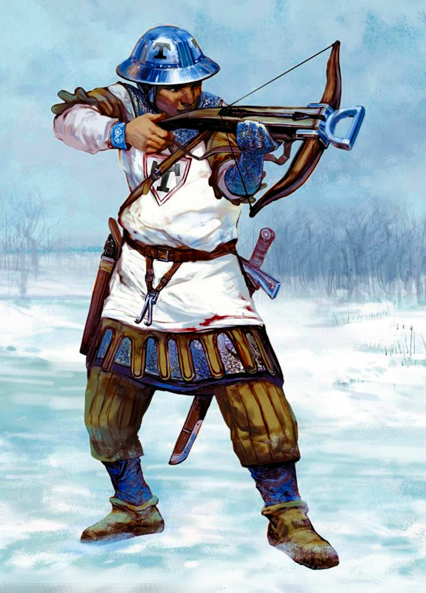
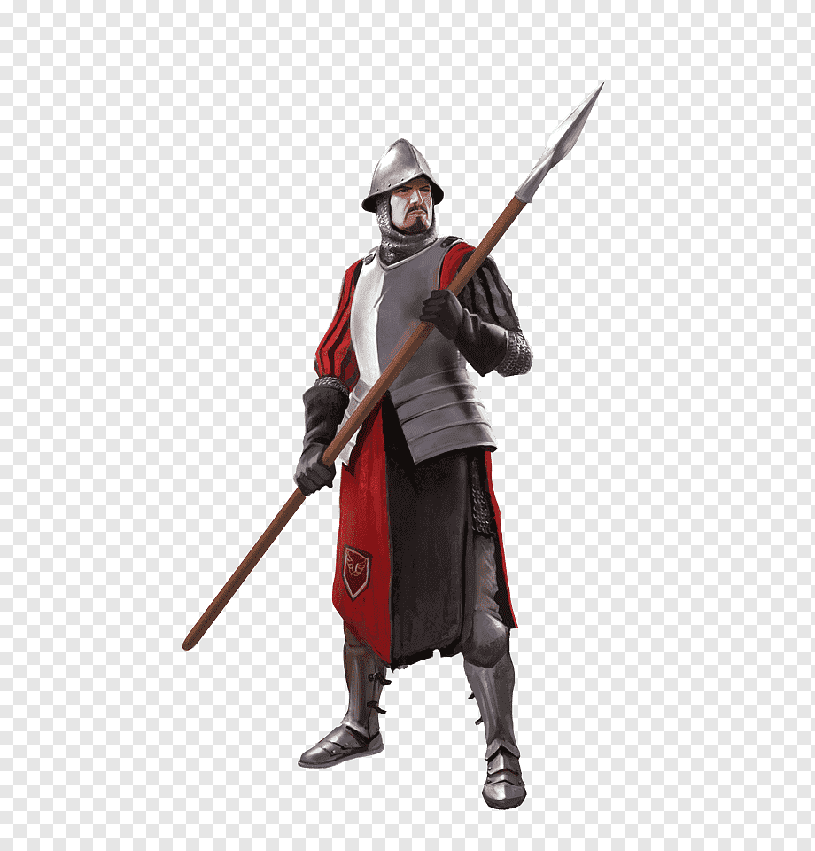
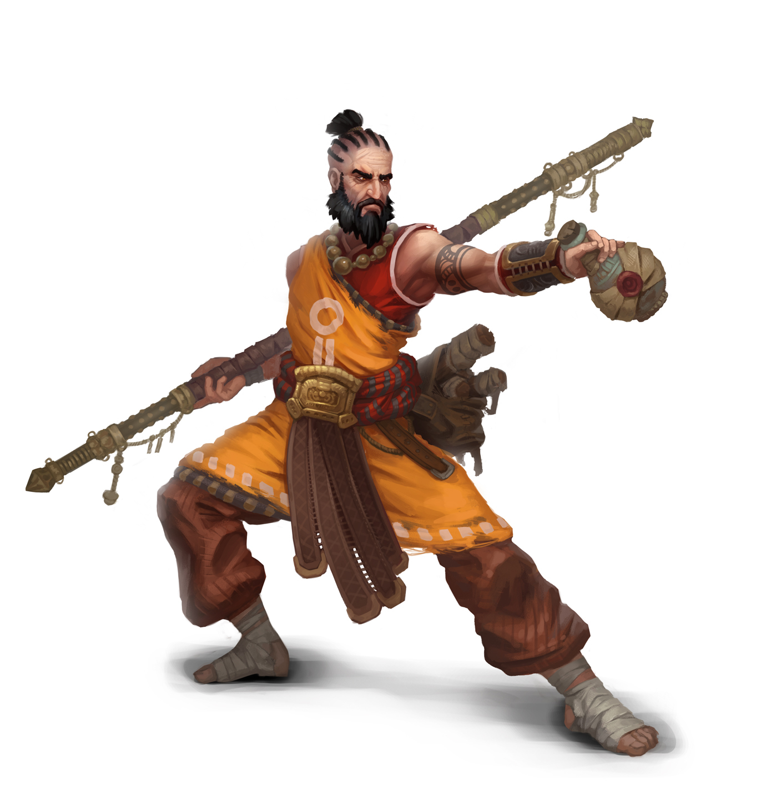
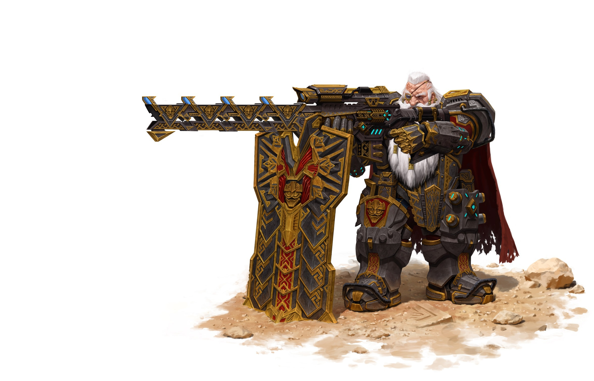
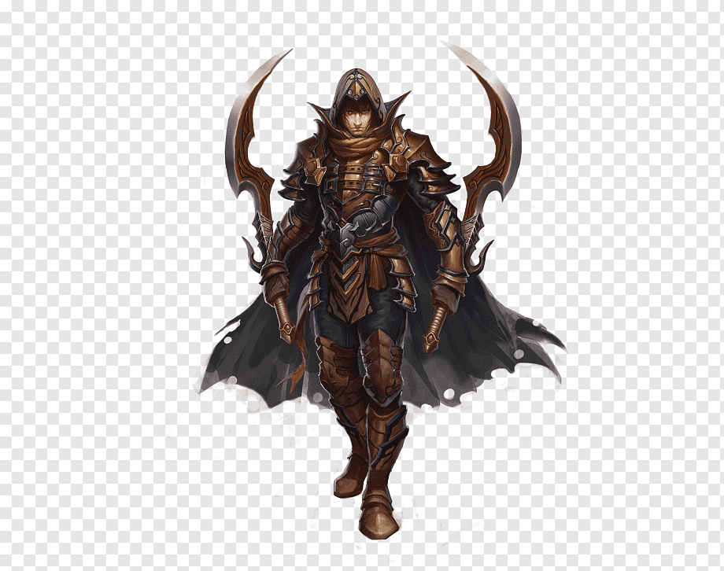
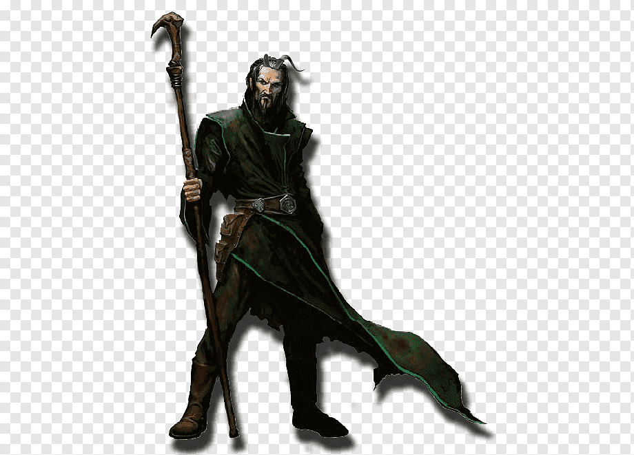
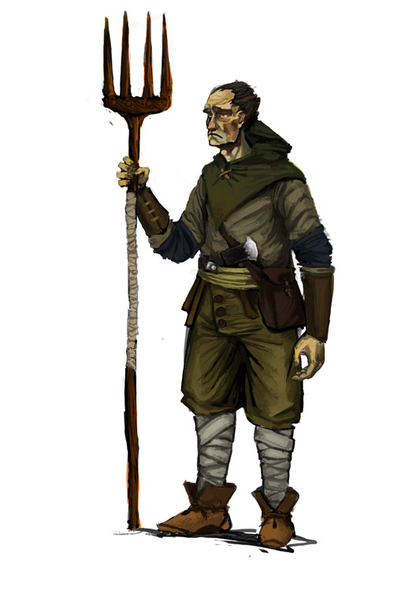

# Игра. Битва светлой и темной команды

Игра представляет собой имитацию битвы двух команд. Бой происходит пошагово. 

Порядок сторон определяется инициативой персонажей.

## Как параметры персонажа влияют на игру

* Здоровье - максимальный уровень здоровья персонажа
* Урон - повреждение, которое наносит персонаж. Для целителей урон отвечает за количество здоровья, которое целитель возвращает выбранному персонажу.
* Шанс критического удара - шанс удвоить урон или целебное свойство при атаке.
* Уровень брони - снижает входящий урон.
* Уклонение - шанс снизить входящий урон в 10 раз.
* Инициатива определяет порядок ходов.

## Светлая сторона

### Арбалетчик

#### Боец дальнего боя. Делает два выстрела за ход, выискивая ближайшего противника. 
#### При нулевом запасе стрел превращается в бойца ближнего боя, однако урон снижается в 5 раз. 

* Здоровье: 150 Hp
* Урон: 30 pt X 2
* Шанс критического удара: 20 %
* Уровень брони: 10 pt
* Уклонение: 30 %
* Инициатива: 1 
* Начальное количество стрел: 8 (максимальное количество выстрелов)
* Дистанция атаки: 6 клеток (если враг находится дальше дистанции атаки, урон уменьшается в 2 раза)

### Пикинер

#### Боец ближнего боя. Перемещается к ближайшему врагу на одну клетку за ход.
#### Может прикрываться щитом, увеличивая броню в два раза.

* Здоровье: 300 Hp
* Урон: 70 pt
* Шанс критического удара: 10 %
* Уровень брони: 30 pt
* Уклонение: 10 %
* Инициатива: 2

### Монах
#### Выполняет роль лекаря на поле. Находит самого покалеченного союзника и восстанавливает ему здоровье.
#### Если здоровье всех союзников максимальное, то наносит магический урон самому покалеченному врагу.
#### Магический урон игнорирует броню и уклонение цели, однако тратит половину манны
#### Если все союзные бойцы ближнего боя пали, то начинает накапливать манну, пока ее не станет достаточно для воскрешения союзника
#### Когда запас манны станет максимальным, то тратит всю манну для воскрешения падшего союзника

* Здоровье: 100 Hp
* Урон: 50 pt
* Шанс критического удара: 10 % 
* Уровень брони: 5pt
* Уклонение: 20%
* Инициатива: 3
* Запас манны: 120 Mp

## Темная сторона

### Снайпер

#### Боец дальнего боя. Наносит урон ближайшему врагу.
#### При нулевом запасе стрел превращается в бойца ближнего боя, однако урон снижается в 5 раз.

* Здоровье: 150 Hp
* Урон: 60 pt
* Шанс критического удара: 20 %
* Уровень брони: 10 pt
* Уклонение: 30 pt
* Инициатива: 1
* Начальное количество стрел: 4 (максимальное количество выстрелов)
* Дистанция атаки: 6 клеток (если враг находится дальше дистанции атаки, урон уменьшается в 2 раза) 

### Разбойник

#### Боец ближнего боя. Перемещается к ближайшему врагу на одну клетку за ход.
#### Может на время становиться невидимым для противника, увеличивая шанс уклонения до 100 %.

* Здоровье: 300 Hp
* Урон: 50 pt
* Шанс критического удара: 10 %
* Уровень брони: 30 pt
* Уклонение: 10 %
* Инициатива: 2

### Колдун
#### Выполняет роль лекаря на поле. Находит самого покалеченного союзника и восстанавливает ему здоровье.
#### Если здоровье всех союзников максимальное, то наносит магический урон всем врагам.
#### Магический урон игнорирует броню и уклонение цели, однако тратит половину манны
#### Если все союзные бойцы ближнего боя пали, то начинает накапливать манну, пока ее не станет достаточно для воскрешения союзника
#### Когда запас манны станет максимальным, то тратит всю манну для воскрешения падшего союзника

* Здоровье: 100 Hp
* Урон: 50 pt
* Шанс критического удара: 10 %
* Уровень брони: 5pt
* Уклонение: 20%
* Инициатива: 3
* Запас манны: 120 Mp

## Нейтральные персонажи

### Подмастерье

#### Персонаж поддержки. 
#### Возвращает бойцу дальнего боя такое количество стрел, которое тот потратил за свой ход.
#### Не перемещается по полю, но может атаковать в ближнем бою, если враг подошел слишком близко.

* Здоровье: 200 Hp
* Урон: 10 pt
* Шанс критического удара: 0 %
* Уровень брони: 0 pt
* Уклонение: 20 %
* Инициатива: 4
